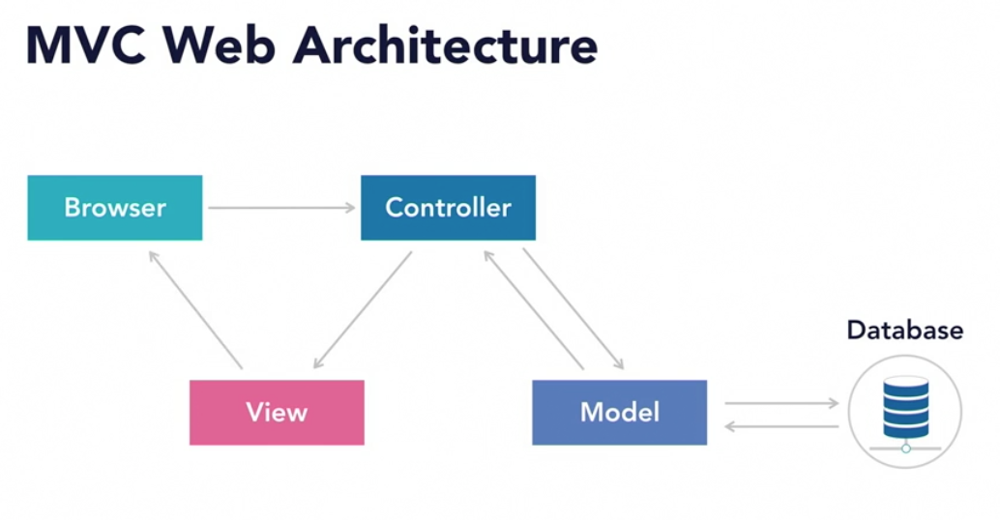
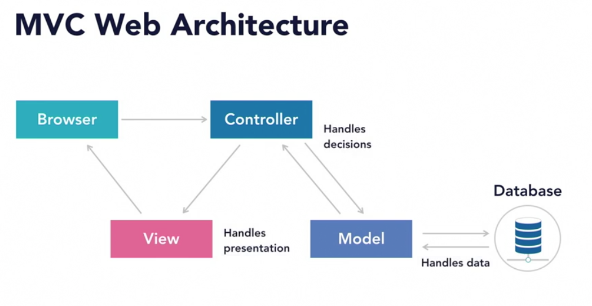
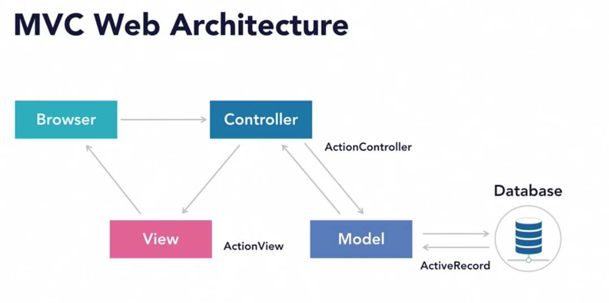
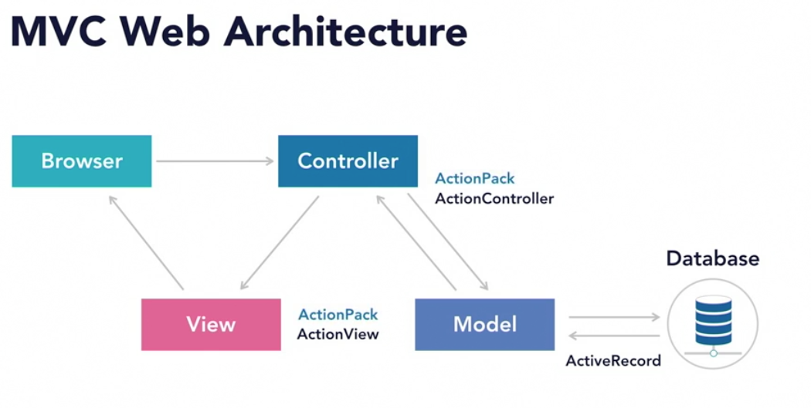

## Stands for
- (M)odel
- (V)iew
- (C)ontroller

## Model

The model refers to the data objects that we use. It's the object oriented approach to design. Many things can be objects in our models, but the data in our database will the most common type of object that we'll put there.

## View

The view is the presentation layer. It's what the user sees and interacts with, the webpages, the HTML, the CSS, and the JavaScript.

## Controller

The controller processes and responds to user events, such as clicking on links and submitting forms. The controller will make decisions based on the request and then control what happens in response. It controls the interaction with our models and our views.

