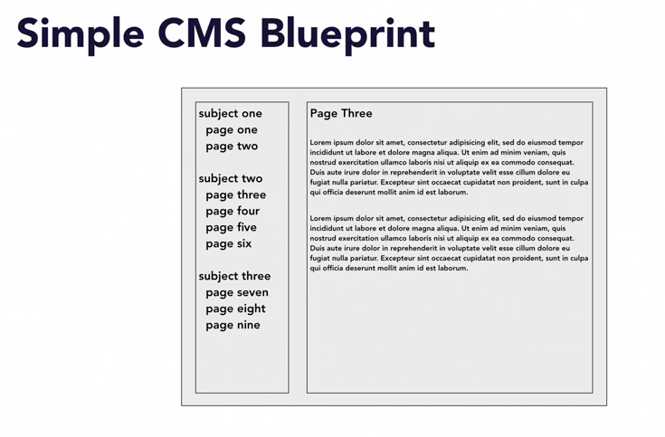
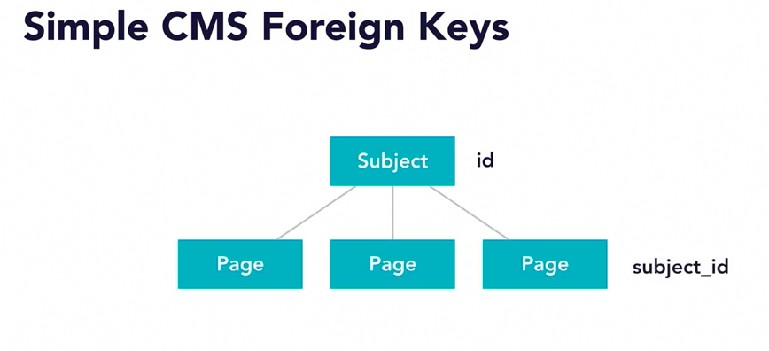

## Creating a database

- set up a user in MySQL
- configure the db in Rails: config/database.yml
- `bundle exec rails db:create`

# Migrations

Ways of managing database tables:
- can use legacy database tables
- can manually manage database tables
- can use RoR migrations

What is a migration?
- set of database instructions
- written in Ruby
- 'Migrate' the database from one state to another
- instructions for moving 'up' to a new state
- instructions for moving 'down' to the previous state

Why use migrations?
- keeps database schema with application code
- executable and repeatable
- allows sharing schema changes
- allows writing Ruby instead of SQL
- able to access project code

# Generate migrations

`bundle exec rails generate migration MigrationName`
  or
`bundle exec rails g migration MigrationName`

`bundle exec rails g model ModelName`

Migration files will be stored within /db directory.

Let's generate a migration:
`bundle exec rails generate migration DoNothingYet`

Look at the generated file.
File name includes a timestamp - makes it unique - makes it easy to order migrations.
`change` method is shorthand for `up` and `down`

Migration methods
- any Ruby code can go in there
- create_table
- drop_table
- rename_table
- add_column
- remove_column
- rename_column
- etc...

`bundle exec rails g model User first_name:string last_name:string, email:string`

Let's have a look at the migration file
id missing from file but it's added by default

## Run migrations

`bundle exec rails db:migrate`

Log into mysql and check out the new table
`mysql -u rails_user -p simple_cms_development`
`SHOW TABLES;`
`SHOW FIELDS FROM users;`
`SELECT * FROM schema_migrations;`

That is how Rails keeps track of which migrations have been run.

`bundle exec rails db:migrate:status`
`bundle exec rails db:migrate VERSION=0`
`bundle exec rails db:migrate:status`
`bundle exec rails db:migrate VERSION=[timestamp]`

# Challenge

Generate models for:
- Subject
- Page

Subject columns:
- name (string)
- position (integer)
- visible (boolean)

Page columns:
- subject_id <- foreign key
- name (string)
- position (integer)
- visible (boolean)
- permalink (string)
- content (text)

How to add a foreign key to a table in a migration?
`t.references :subject`

Play around with these migrations - up, down, all the way back, etc...
