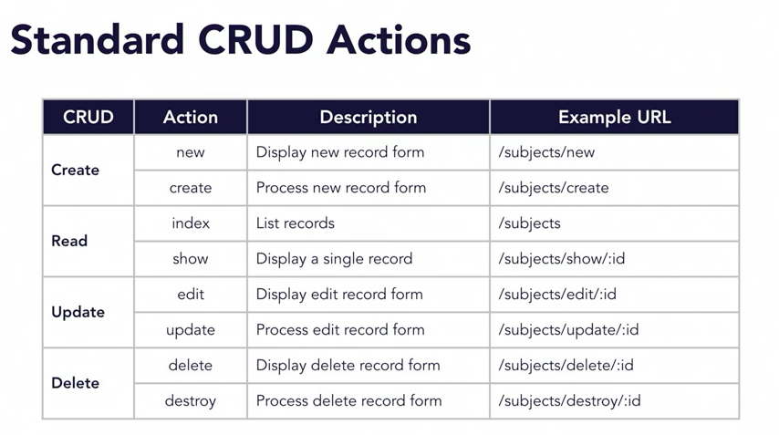
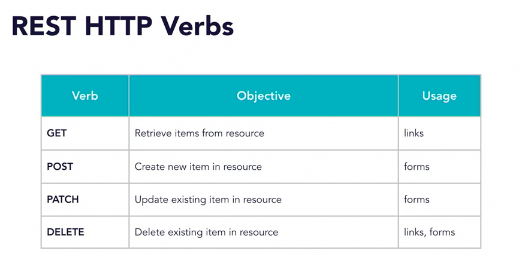
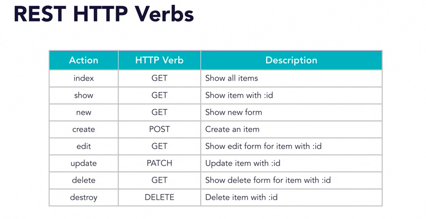
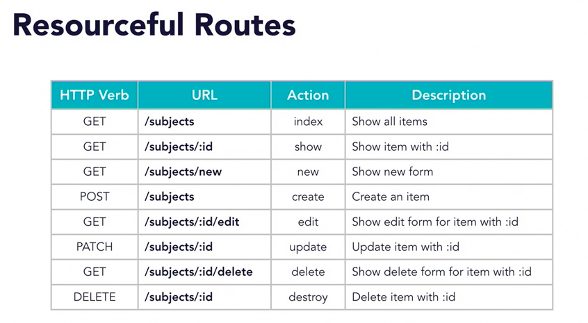
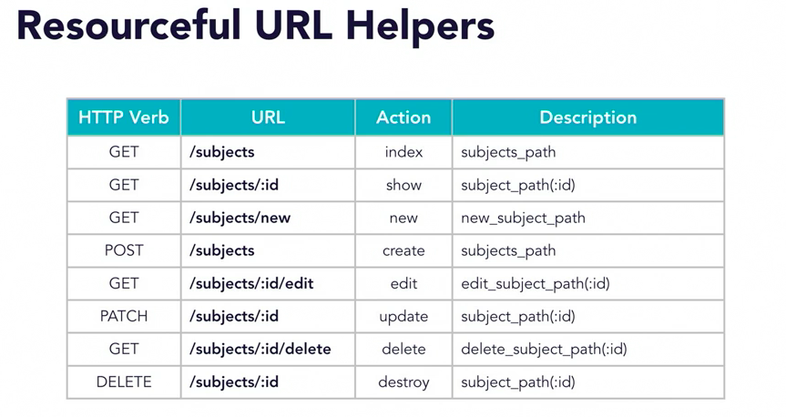

## CRUD

- create
- read
- update
- delete



- esually separate controller for each model
- e.g.: SubjectsController, PagesController
- allows for clear, well-structured URLs
- e.g: subjects/new, pages/new

`bundle exec rails g controller Subjects index show new edit delete`

`bundle exec rails g controller Pages index show new edit delete`

Let's check out the generated controllers

Also let's have a look at the routes added

## REST and resourceful routes

REST = representational state transfer

TODO: add images




Resourceful routes:
- Rails default
- optimized for REST
- simple, consistent, organized structure

TODO: add image


shortcut for defining all those routes:
`resources :subject`

`resources :pages`

`resources :users, except: [:show]`

`resources :users, only: [:index, :show]`

```
resources subjects do
  member do
    get :delete
  end

  collection do
    get :export
  end
end
```

Let's add these routes to our routes.rb

## Resourcful URL helpers

`{ controller: 'subjects', action: 'show', id: 5 }`

becomes: `subject_path(5)`

TODO: add image


These helpers can be used in our links:

`<% link_to('All subjects', subjects_path) %>`

`<% link_to('Show subject', subject_path(@subject.id)) %>`

`<% link_to('Edit subject', edit_subject_path(@subject)) %>`

Let's add a subjects (index) link to our demo index
